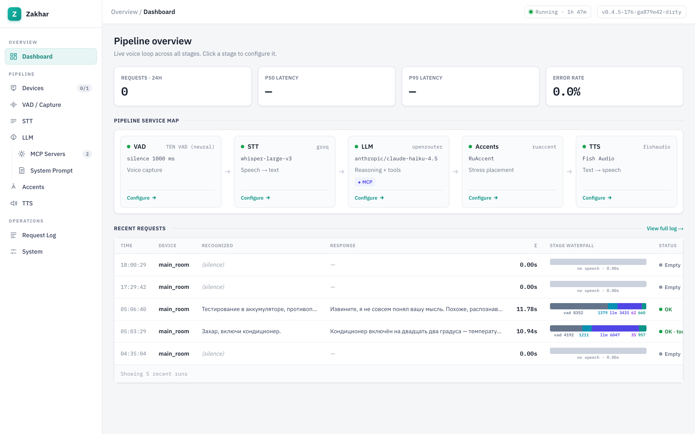
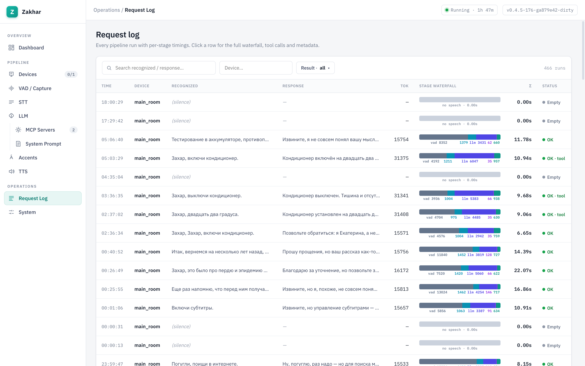
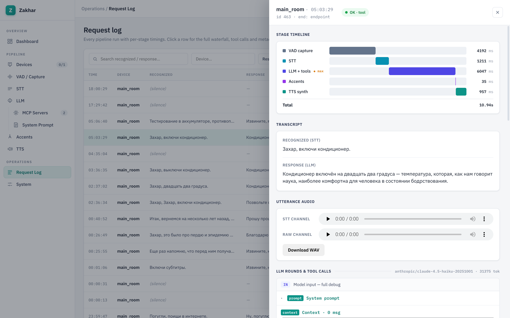

# zakhar-voice-assistant

*Также доступно на [английском](README.md).*

Клиентский голосовой ассистент для ESP32-колонки «HA Voice PE», заменяющий Home
Assistant в голосовом цикле. Сервер подключается к колонке по ESPHome Native API
(как клиент) и выполняет конвейер: STT (облачный Whisper, по умолчанию Groq) →
LLM (по умолчанию Claude Haiku 4.5 через OpenRouter) → инструменты умного дома
через внешний MCP-сервер → RuAccent (расстановка ударений для русского) → TTS
(офлайн Piper / офлайн Silero / облачные Yandex SpeechKit / Fish Audio), возвращая
сгенерированный звук на N колонок.

Управление умным домом — это интеграция через MCP: приложение выступает
MCP-клиентом, который подключается к внешнему MCP-серверу умного дома (размещён в
Node-RED через node-red-contrib-mcp-server), настроенному в `core.mcp_servers` в
`data/config.json`, публикует его инструменты для модели и запускает агентный
цикл вызова инструментов.

## Скриншоты

Админ-панель (отдаётся на `PANEL_PORT`, по умолчанию 8201) — одностраничное
приложение: живой обзор конвейера, поисковый журнал запросов и детальный разбор
каждого прогона.

### Дашборд — обзор конвейера

Карта сервисов по стадиям (VAD → STT → LLM → Accents → TTS) с живыми метриками и
последними запросами.



### Журнал запросов

Каждый прогон конвейера с поэтапными диаграммами таймингов, счётчиками токенов и
статусом; фильтруется по тексту, устройству и результату.



### Детали прогона

Клик по строке открывает полную ленту стадий, транскрипт STT/LLM, захваченное
аудио реплики и вызовы инструментов LLM по раундам.



## Быстрый старт

Все рутинные действия обёрнуты в `Makefile` (`make help` выводит все цели):

```bash
make install                # создать .venv + установить dev/test-зависимости
make config                 # создать data/config.json из шаблона, затем отредактировать
make models                 # скачать офлайн-модели (Vosk/Piper/Silero) в models/
make test                   # запустить тесты
make run                    # запустить приложение
```

Python-цели (`make test`, `make run`) сами создают и переиспользуют локальный
`.venv` — системный Python не нужен.

Офлайн-бэкендам нужны файлы моделей в `models/`. `make models` скачивает их все;
можно скачать по одной — `make models-vosk` / `make models-piper` /
`make models-silero-vad` / `make models-silero-tts` (каждая пропускает уже
присутствующий файл). Голос Silero TTS работает на PyTorch — это опциональная
зависимость, намеренно НЕ включённая в `requirements.txt` и в Docker-образ, —
поэтому установите её сами (например, `pip install torch`), чтобы пользоваться
этим провайдером.

Про Docker: публикуемый образ идёт БЕЗ файлов моделей (Dockerfile их не скачивает
и не вшивает `models/`), а compose-том монтирует только `/app/data`, поэтому из
коробки контейнер работает лишь на облачных провайдерах. Чтобы задействовать
офлайн-бэкенды в Docker, предоставьте заполненный каталог `models/` (например,
выполните `make models` на хосте и смонтируйте его в контейнер).

## Конфигурация

Вся конфигурация — в одном JSON-файле `data/config.json` (создаётся при первом
запуске из `templates/default_config.json`; `make config` создаёт его явно). Через
переменные окружения настраиваются только `PANEL_HOST` / `PANEL_PORT` (см. ниже);
всё остальное — в JSON. ВСЕ настройки JSON применяются вживую (горячо) в момент
сохранения через панель/API: бэкенды, источники инструментов, аудиосервер,
устройства и напоминания переконфигурируются на месте — в панели нет понятия
перезапуска. Единственное, чего НЕТ в JSON-конфиге, — это собственные host/port
админ-панели: они берутся из переменных окружения `PANEL_HOST` / `PANEL_PORT`
(по умолчанию `0.0.0.0` / `8201`) и применяются при старте процесса.

Структура (полный дефолт см. в `templates/default_config.json`):

- **Провайдеры стадий** — для каждой стадии вы выбираете один провайдер и
  настраиваете его:
  - `vad`: `webrtc` (WebRTC VAD) — агрессивность; пороги энд-поинтинга и
    авто-усиление VAD «только для решения» (`mic_auto_gain`, в основных настройках
    захвата голоса) остаются в `core.vad`.
  - `stt`: `groq` (облачный Whisper) | `vosk` (офлайн) | `yandex` (SpeechKit v3, стриминг по gRPC) — `selected` + `instances` на каждый провайдер.
  - `llm`: `openrouter` | `groq` — model, api_key, temperature, max_tokens, max_tool_rounds.
  - `stress`: `ruaccent` (офлайн-расстановка ударений для русского) — работает
    между LLM и TTS, отмечает ударные гласные в ответе (канонический текст с
    `+гласная`, который уже адаптирует каждый TTS-бэкенд); `enabled` (включён по
    умолчанию) + размер модели.
  - `tts`: `piper` (офлайн) | `silero` (офлайн, нужен PyTorch) | `yandex` (SpeechKit) | `fishaudio` (облако) — голос/ключ/и т. п. на каждый провайдер.
  Каждый провайдер описывает свою схему настроек (`src/plugins/<stage>/<id>.py`);
  добавление провайдера — это один файл, без изменений в ядре конфига.
- **`core`** — настройки вне провайдеров: `context` (max_turns / ttl_seconds / dir),
  `audio` (host / port / ttl / public_base_url), пороги `vad`,
  `network.external_proxy`, `openweathermap` (api_key / city), `mcp_servers` (список
  `{name, url, token, transport, prompt, slow}` — пометка сервера как `slow`
  заставляет ассистента произнести короткую реплику-заполнитель перед вызовом его
  инструментов), `calendar` (url / username / password / calendar), `esphome.port`,
  `prompt.system_prompt_path` (только legacy-сид — промпты теперь живут как
  именованные профили в `data/prompts.db`), `agent_mcp` (enabled — обращённый к
  агенту MCP-эндпоинт, отдаваемый панелью на `/mcp`), `runs` (enabled /
  retention_days), `reminders` (enabled), `devices` (список `{name, host, psk}`),
  `tts_timeout`, `log_level`.

API-ключи — это обычные строковые поля в JSON (сервис рассчитан на доверенную LAN);
`data/` в gitignore, поэтому `config.json` и его ключи никогда не попадают в
коммиты.

## Agent MCP-сервер

Приложение само является MCP-**сервером**, так что внешний агент (например, Claude)
может управлять ассистентом. Эндпоинт отдаёт сама админ-панель:
`http://<host>:8201/mcp` (MCP streamable HTTP, на порту панели — переменная
`PANEL_PORT`, по умолчанию 8201; отдельного сервера или порта нет). Включение/
выключение — `core.agent_mcp.enabled` в JSON-конфиге, редактируется в панели
(страница System) и применяется вживую на каждый запрос. Аутентификации НЕТ (сервис
для доверенной LAN, как и админ-панель). Инструменты:

- `list_runs(limit, device?, search?)` — недавние голосовые взаимодействия (текст пользователя, ответ, тайминги).
- `get_run(run_id)` — полная запись одного взаимодействия (раунды инструментов, тайминги, ошибки).
- `get_config()` — полный живой документ конфигурации.
- `update_config(patch)` — глубокое слияние патча конфига; изменения применяются вживую (горячая перезагрузка).
- `list_devices()` — настроенные колонки с их живым статусом.
- `say(text, device?)` — произнести произвольный текст на колонке (TTS + анонс).
- `ask(text, device?, speak?)` — полный ход ассистента (LLM + инструменты умного
  дома + контекст разговора), как если бы это сказал пользователь; ответ при
  желании озвучивается.

## Что здесь

| Путь | Назначение |
|------|------------|
| `Makefile` | Единая точка входа для повторяющихся действий: `install`, `config`, `models`, `test`, `run`. Запустите `make help`. |
| `src/` | Код приложения. Ядро конфига: `config_store.py` + `config_service.py`; провайдеры в `src/plugins/`. |
| `tests/` | Набор pytest (выполняется в CI до сборки образа). |
| `data/` | Изменяемое состояние: `config.json`, контекст по устройствам, `prompts.db` (именованные профили системных промптов). В gitignore, монтируется как том. |
| `models/` | Файлы офлайн-моделей (Vosk / Piper / Silero), скачиваются `make models`. В gitignore; не вшиты в Docker-образ. |
| `templates/` | Закоммиченные эталонные ассеты (`default_prompt.md`, `default_config.json`), засеваются в `data/` при первом запуске. |
| `Dockerfile` | Тонкая одностадийная сборка; зависимости кешируются до кода; без `EXPOSE`. |
| `docker-compose.yml` | Шаблон деплоя — образ из `ghcr.io`, том, аудиопорт публикуется в LAN, метка watchtower. |
| `.github/workflows/` | CI: `test` → `build` → пуш в `ghcr.io` (`latest` + sha). |
| `AGENTS.md` | Конвенции / онбординг для агентов. |

## Правила в двух словах

Всё изменяемое состояние — в `data/`; вся конфигурация — в `data/config.json`
(провайдеры сами описывают свои настройки; ядро конфига никогда не хардкодит их
поля); тесты обязательны и гейтят сборку Docker; деплой — готовым образом из
`ghcr.io` через docker-compose. В отличие от публичного веб-сервиса, аудиопорт
публикуется прямо в LAN (без Traefik), чтобы колонки могли забирать аудио.
