# Изоляция стадий пайплайна: проект рефакторинга

Целевая архитектура: **VAD → STT → LLM → TTS — одинаковые чёрные кирпичики**.
Система (оркестратор `Pipeline`, device-слой, панель, reconfig) знает только
интерфейс стадии и ничего — о её реализации. Любую стадию можно заменить
плагином, не трогая оркестратор.

Документ описывает 9 решений (R1–R9) для проблем, найденных аудитом, с
диаграммами «как сейчас / как будет» и планом миграции.

---

## 0. Общая картина

### Как сейчас

`Pipeline` — god-object: VAD вшит в него, текст для TTS готовится в LLM-слое,
device-протокол (VAET) прошит сквозь все стадии, система лезет в кирпичи мимо
оркестратора.

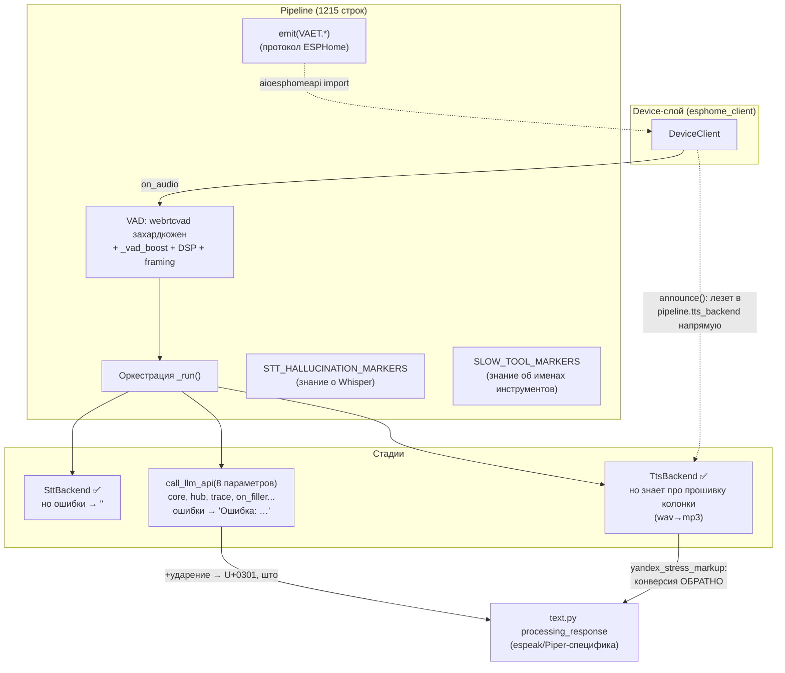

### Как будет

`Pipeline` — тонкий оркестратор. Четыре стадии — равноправные плагины в одном
`REGISTRY`, с единым контрактом ошибок. Система общается с пайплайном через
нейтральные события; всё «знание о реализации» уехало внутрь своих кирпичей.

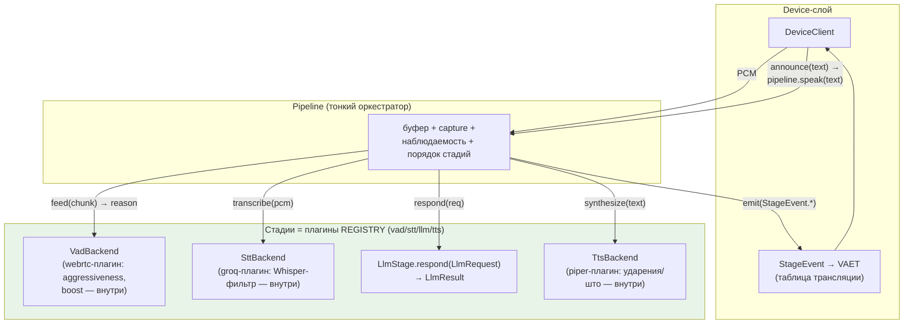

Сводка целевых контрактов:

| Стадия | Контракт | Ошибки | Плагин |
| --- | --- | --- | --- |
| VAD | `open(policy) -> VadSession`; `session.feed(chunk) -> reason \| None` | `StageError("vad")` | `plugins/vad/webrtc.py` |
| STT | `transcribe(pcm) -> str` (`""` = речь не распознана) | `StageError("stt")` | `plugins/stt/{groq,vosk}.py` |
| LLM | `respond(LlmRequest) -> LlmResult` | `StageError("llm", kind=...)` | `plugins/llm/*` |
| TTS | `synthesize(text) -> (mime, bytes)` | `StageError("tts")` | `plugins/tts/*` |

Все четыре строятся одинаково: `ConfigService.create(cat)` → провайдер из
`REGISTRY` → горячая замена через `Reconfigurator._rebuild_backend_cats`.

---

## R1. Единый контракт ошибок стадий

### Проблема

Три стадии — три канала ошибок ([stt.py:96-106](../src/stt.py#L96-L106),
[llm.py:101-104](../src/llm.py#L101-L104), [pipeline.py:959](../src/pipeline.py#L959)):

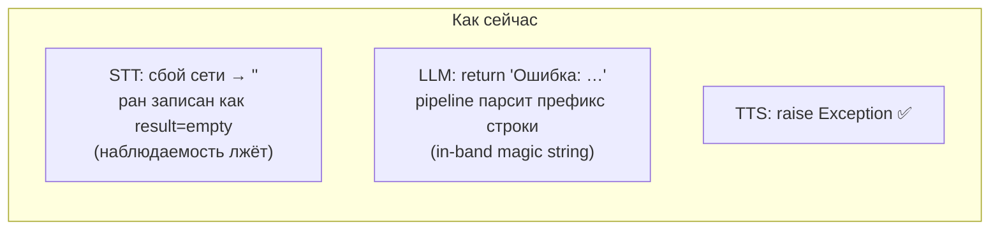

### Решение

Один модуль `src/stage_errors.py`:

```python
class StageError(Exception):
    """Uniform stage failure: every backend raises this instead of
    sentinel return values. `kind` lets the orchestrator map specific
    failures (e.g. rate limits) to configured spoken phrases."""

    def __init__(self, stage: str, message: str, *, kind: str = "error"):
        super().__init__(message)
        self.stage = stage          # "vad" | "stt" | "llm" | "tts"
        self.kind = kind            # "error" | "rate_limit" | "timeout" | ...
```

Правила:

- **STT**: сетевые/HTTP-сбои → `raise StageError("stt", ...)`. Возврат `""`
  остаётся легальным и означает ровно одно: «речи не распознано».
- **LLM**: `call_llm_api`/`LlmStage.respond` больше не возвращает русские
  строки. Сбой → `StageError("llm", msg, kind="rate_limit" | "error")`.
  Префикс `"Ошибка:"` и `reply.startswith(...)` удаляются.
- **TTS**: уже бросает исключения — оборачиваем в `StageError("tts", ...)` на
  границе стадии (бэкенды могут бросать что угодно, провайдер-обёртка
  нормализует).
- **Pipeline** — единственное место, где ошибка превращается в поведение:

```python
# pipeline._run(), sketch
try:
    result = await llm_stage.respond(req, on_filler=...)
except StageError as e:
    record["result"] = "error"
    record["error_stage"] = e.stage.upper()
    record["error_text"] = str(e)
    spoken = self._spoken_fallback(e)   # maps (stage, kind) -> llm_cfg.reply_*
    if spoken:
        ...  # continue into TTS with the fallback phrase
    else:
        self._emit(StageEvent.RUN_END, {})
        return
```

Маппинг «что озвучить» (политика — в оркестраторе, фразы — в конфиге, как
сейчас в `LlmConfig.reply_*`):

| Ошибка | Записано в ран | Озвучено |
| --- | --- | --- |
| `stt/error` | `error_stage=STT` | ничего (как сейчас), молчание — честное |
| `llm/rate_limit` | `error_stage=LLM` | `llm_cfg.reply_rate_limit` |
| `llm/error` | `error_stage=LLM` + сырой текст ошибки в `error_text` | новое поле `llm_cfg.reply_error` («Что-то сломалось, попробуй ещё раз») — сырой текст API-ошибки пользователю больше не зачитывается |
| `tts/error` | `error_stage=TTS` | ничего (звука всё равно нет) |

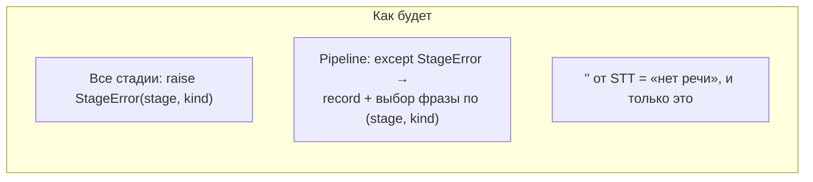

**Файлы**: новый `src/stage_errors.py`; правки `src/stt.py`, `src/llm.py`,
`src/pipeline.py`; `reply_error` в `plugins/llm/base.py::LlmConfig`.

---

## R2. VAD — четвёртый плагин

### Проблема

VAD — единственная стадия без абстракции: `import webrtcvad` в оркестраторе,
стейт-машина end-pointing в `on_audio`, WebRTC-специфичный `_vad_boost` с
константами под конкретный микрофон ([pipeline.py:195-230](../src/pipeline.py#L195-L230),
[638-698](../src/pipeline.py#L638-L698)). Плюс скрытый сговор: reconfig
классифицирует `core.vad.aggressiveness` как `live` только потому, что
`on_start` сам пересоздаёт `webrtcvad.Vad`.

### Решение

Разделить два понятия, которые сейчас слиплись:

1. **Политика end-pointing** (когда фраза кончилась) — generic, остаётся в
   `core.vad`: `silence_ms`, `min_speech_ms`, `max_utterance_ms`,
   `no_speech_timeout_ms`. Это настройки пайплайна, не реализации.
2. **Классификатор речь/не-речь** — это и есть заменяемый кирпич:
   `plugins/vad/webrtc.py` (а завтра — `silero.py`). Его конфиг:
   `aggressiveness`, `auto_gain` (бывший boost) и его магические константы.

Контракт (по образцу остальных стадий, но с per-run сессией, потому что VAD
stateful внутри одной фразы):

```python
# src/vad.py — stage interface (mirrors SttBackend/TtsBackend style)
@dataclass(frozen=True)
class EndpointPolicy:
    """Generic end-pointing thresholds, read from core.vad per run."""
    silence_ms: int
    min_speech_ms: int
    max_utterance_ms: int
    no_speech_timeout_ms: int

class VadSession(ABC):
    """Per-utterance state. feed() consumes a PCM chunk (any size; the
    session does its own framing) and returns a finalize reason
    ("endpoint" | "maxlen" | "no_speech") or None to keep listening."""
    @abstractmethod
    def feed(self, chunk: bytes) -> str | None: ...

class VadBackend(ABC):
    """Stateless factory; one session per voice run."""
    @abstractmethod
    def open(self, policy: EndpointPolicy) -> VadSession: ...
```

Что куда переезжает из `pipeline.py`:

| Сейчас в Pipeline | Будет |
| --- | --- |
| `webrtcvad.Vad`, пересоздание в `on_start` | внутри `WebRtcVadSession` (сессия живёт один ран — «пересоздание при смене конфига» исчезает как проблема) |
| нарезка на 640-байтные фреймы, `_frame_rem` | внутри сессии |
| счётчики `_speech_ms/_silence_ms/_elapsed_ms` | внутри сессии |
| `_vad_boost`, `_VAD_BOOST_TARGET/FLOOR`, `_vad_peak` | внутри webrtc-плагина (`auto_gain`) |
| выбор `reason` (endpoint/maxlen/no_speech) | внутри сессии (по `EndpointPolicy`) |
| `HARD_CAP_BYTES`, буфер, capture-режим, выбор mic-канала | остаются в Pipeline (это память/устройство, не VAD) |
| `_highpass`, `_normalize_peak`, `_trim_start_pcm` | `src/audio_prep.py` — pre-STT conditioning, вызывается Pipeline'ом (отдельный шаг, не VAD) |

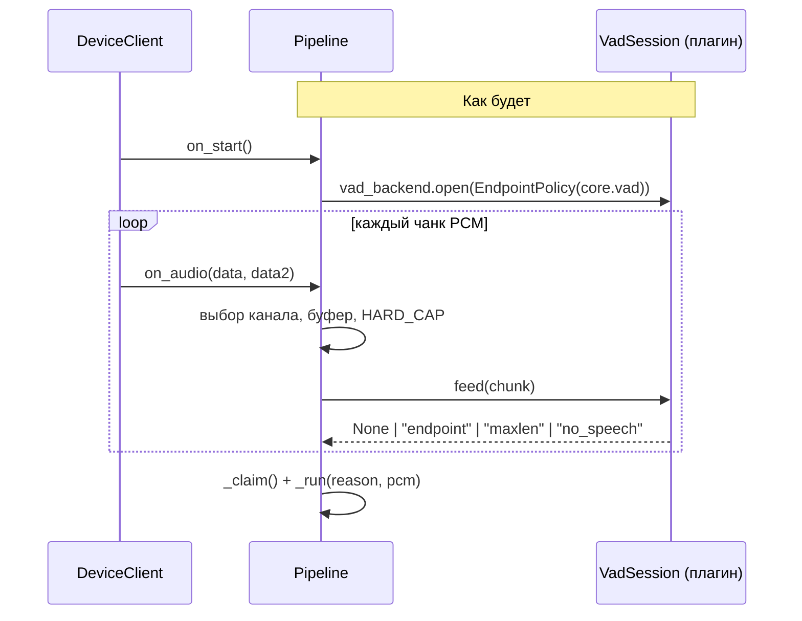

Интеграция с конфигом/reconfig — **ровно как у остальных стадий**:

- `STAGE_CATEGORIES = ("vad", "stt", "llm", "tts")` в
  [config_service.py](../src/config_service.py); `ConfigDoc` получает слот
  `vad: StageSlot` (миграция: при загрузке старого документа подставить
  `{"selected": "webrtc", "instances": {}}`, перенеся `core.vad.aggressiveness`
  + `mic_normalize`→`auto_gain` в инстанс webrtc).
- `reconfig.action_for`: `path.startswith("vad")` → `rebuild_backends`;
  `core.vad.*` (политика) остаётся `live`. Хак с пересозданием Vad в
  `on_start` удаляется — сговор reconfig↔pipeline исчезает.
- Панель получает категорию VAD бесплатно: `catalog()` уже генерик.

**Файлы**: новые `src/vad.py`, `src/plugins/vad/{__init__,webrtc}.py`,
`src/audio_prep.py`; правки `pipeline.py` (минус ~200 строк),
`config_service.py`, `reconfig.py`, `config_store`-миграция, `core_config.py`
(убрать `aggressiveness` из `VadConfig` — он уезжает в webrtc-плагин;
`mic_normalize` остаётся как conditioning-тумблер pre-STT нормализации, а его
VAD-boost-половина становится `auto_gain` плагина — при миграции значение
копируется в обе стороны, чтобы поведение не изменилось).

---

## R3. Текстовый контракт LLM → TTS: пост-процессинг уезжает в TTS-бэкенды

### Проблема

Выход LLM-стадии форматируется под **один** TTS-движок
([text.py](../src/text.py) вызывается в [llm.py:141](../src/llm.py#L141)):
ударения конвертируются в espeak-нотацию (U+0301), «что→што». Yandex-бэкенд
конвертирует ударения **обратно** ([tts.py:25-27](../src/tts.py#L25-L27)), а
«што» честно зачитывает как опечатку.

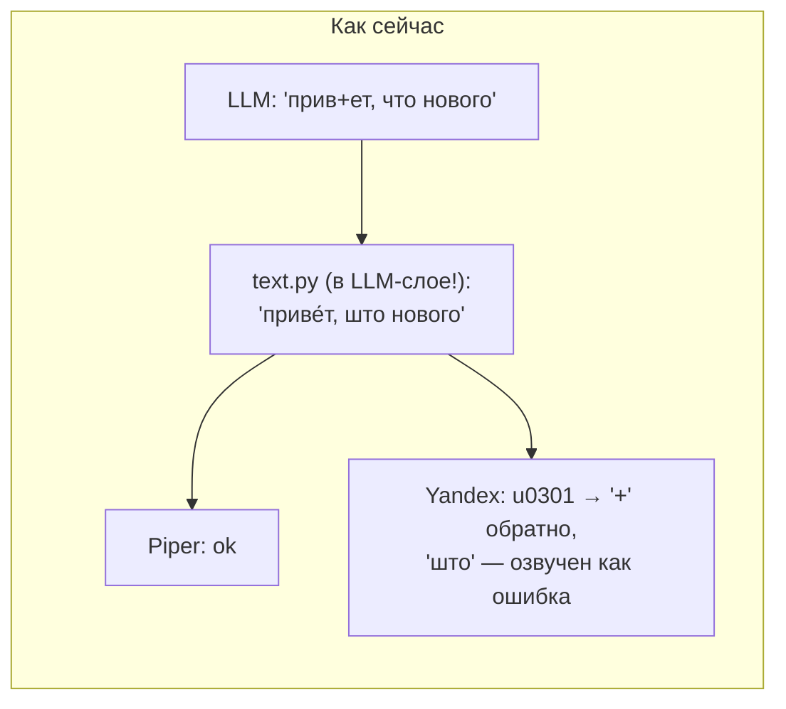

### Решение

Зафиксировать **канонический формат текста между стадиями** — тот, что модель
производит сама (он же описан в промпте): *plain text, ударение = `+` перед
гласной*. Каждый TTS-бэкенд — чёрный ящик, который сам адаптирует канон под
свой движок.

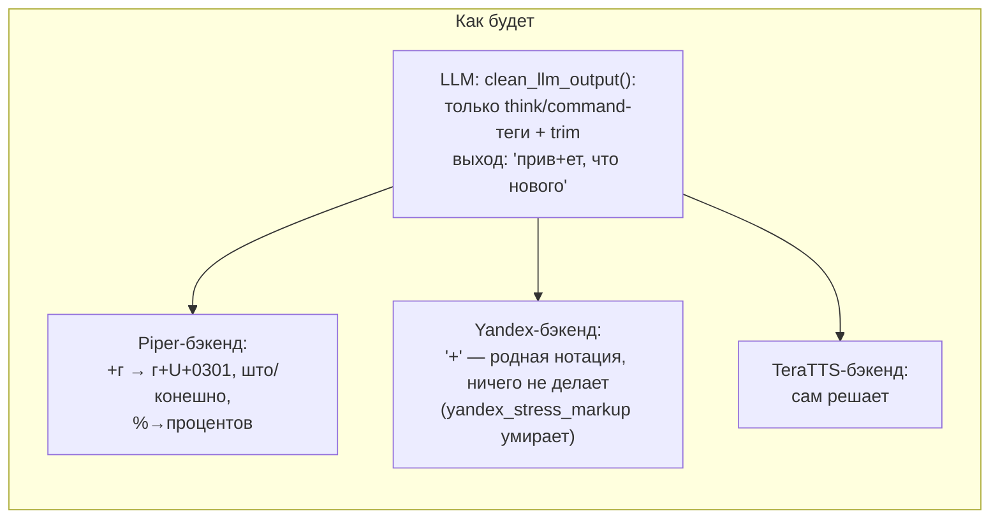

Раскладка `text.py`:

```python
# src/llm_text.py — owned by the LLM stage
def clean_llm_output(text: str) -> str:
    """Strip <think>/<command> blocks and trim. Stage-agnostic: stress
    marks ('+') and units are passed through untouched."""

# src/plugins/tts/_ru_text.py — shared helpers, opt-in per backend
def stress_to_acute(text) -> str      # "+г" -> "г" + U+0301 (espeak/Piper)
def expand_units(text) -> str         # "%"->"процентов", "м/с"->..., "°С"->...
def phonetic_ru(text) -> str          # "что"->"што", ... (Piper-only hack)
```

- `processing_response` в [llm.py:141,194](../src/llm.py#L141) →
  `clean_llm_output` (там же).
- `PiperTtsBackend.synthesize` начинает с
  `phonetic_ru(expand_units(stress_to_acute(text)))`.
- `YandexTtsBackend`: убирает `yandex_stress_markup` (вход уже в его
  нотации), опционально `expand_units`.
- Бонус: филлеры ([pipeline.py:930](../src/pipeline.py#L930)) и announce
  ([esphome_client.py:295](../src/esphome_client.py#L295)) перестают
  расходиться — обработка происходит в бэкенде, мимо неё пройти нельзя.

**Совместимость**: записи `record["llm_text"]` и панель начинают видеть текст
с `+` вместо U+0301 — это и есть честный выход LLM; runs-store не мигрируем.

**Файлы**: `src/text.py` → `src/llm_text.py` + `src/plugins/tts/_ru_text.py`;
правки `llm.py`, `tts.py` (Piper/Yandex/TeraTTS), `pipeline.py:930`,
тесты `test_text.py`/`test_llm.py`/`test_pipeline.py`.

---

## R4. Нейтральные события пайплайна вместо VAET

### Проблема

`from aioesphomeapi import VoiceAssistantEventType as VAET` в
[pipeline.py:28](../src/pipeline.py#L28): прогресс стадий выражается напрямую
в протобуф-енумах одного транспорта. Второй фронт (Wyoming, WebSocket,
тест без железа) невозможен без переписывания оркестратора.

### Решение

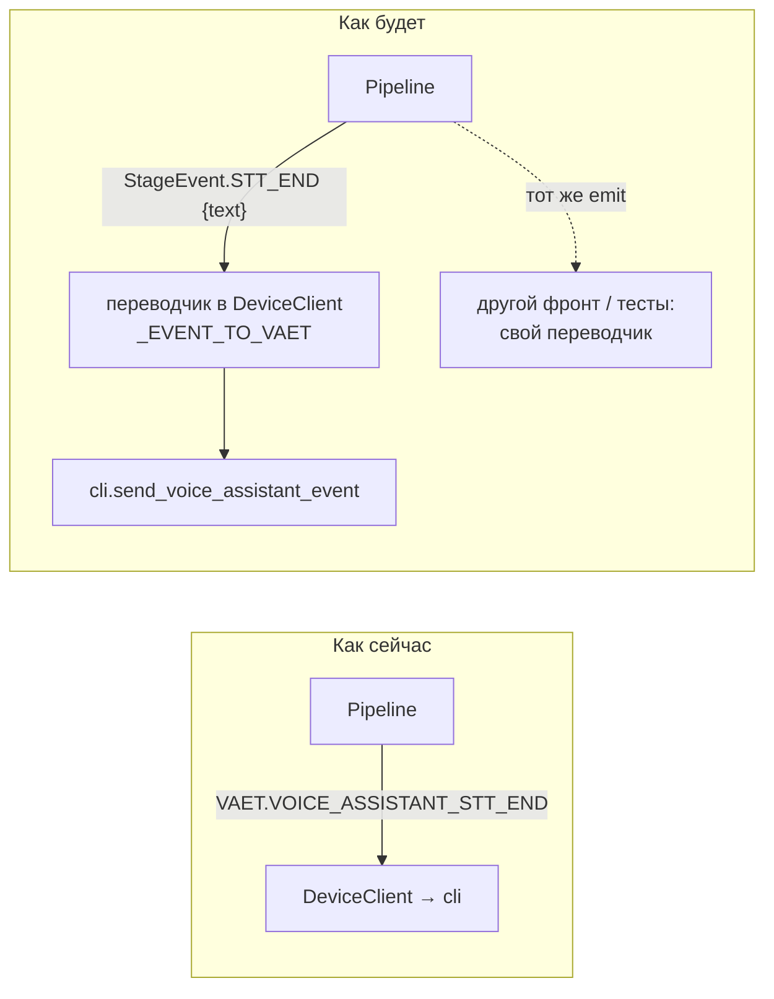

```python
# src/pipeline_events.py — transport-neutral stage progress events
class StageEvent(Enum):
    RUN_START = auto()
    STT_START = auto()
    STT_END = auto()        # data: {"text": str}
    INTENT_START = auto()
    INTENT_END = auto()     # data: {"conversation_id", "continue_conversation"}
    TTS_START = auto()      # data: {"text": str}
    TTS_END = auto()        # data: {"url": str}
    ERROR = auto()          # data: {"code", "message"}
    RUN_END = auto()
```

```python
# esphome_client.py — the ONLY place that knows VAET
_EVENT_TO_VAET = {
    StageEvent.RUN_START: VAET.VOICE_ASSISTANT_RUN_START,
    StageEvent.STT_START: VAET.VOICE_ASSISTANT_STT_START,
    # ... 1:1 table
}

def _on_pipeline_event(self, event: StageEvent, data: dict) -> None:
    self.cli.send_voice_assistant_event(_EVENT_TO_VAET[event], data)
```

`DeviceClient` уже инжектит `pipeline.send_event` на коннекте
([esphome_client.py:100](../src/esphome_client.py#L100)) — меняется только
*что* инжектится: вместо сырого `cli.send_voice_assistant_event` — переводчик.
`Pipeline._emit` и все call-sites переходят на `StageEvent`; импорт
`aioesphomeapi` из `pipeline.py` удаляется. Чисто механический рефакторинг.

**Файлы**: новый `src/pipeline_events.py`; правки `pipeline.py`,
`esphome_client.py`, тесты, где ассертятся VAET-события.

---

## R5. Один путь «текст → звук на колонке»

### Проблема

Та же операция существует в трёх копиях с разной семантикой:

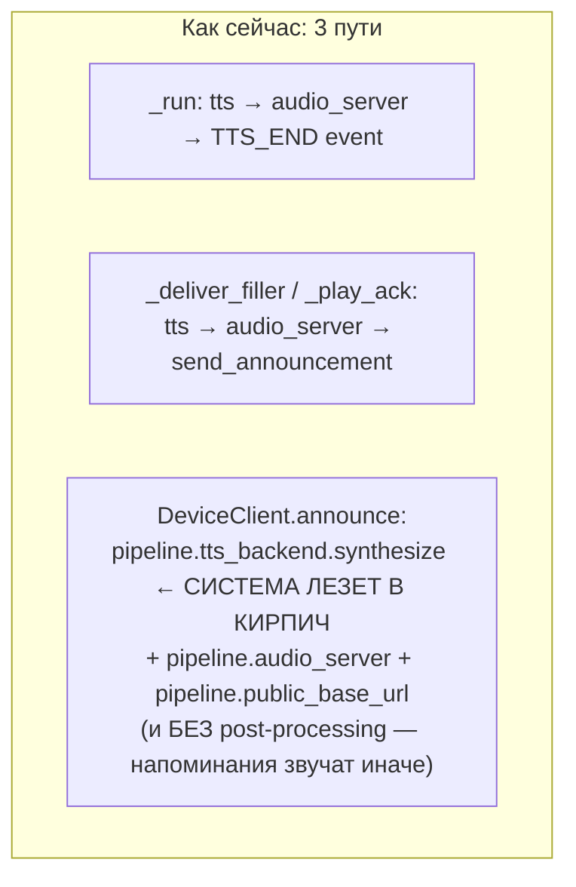

### Решение

Pipeline получает один публичный метод — внешняя граница пайплайна для
проактивной речи; device-слой больше не трогает `pipeline.tts_backend`:

```python
# pipeline.py
async def speak(self, text: str) -> None:
    """Public entry for proactive speech (reminders, panel tests).
    Synthesizes via the CURRENT tts stage, serves the clip, and plays it
    on the announcement channel. The single text->speaker path shared by
    fillers and external callers."""
    mime, audio = await self.tts_backend.synthesize(text, "ru")
    url = self._serve_audio(mime, audio)           # audio_server.put + tts_url
    if self.send_announcement is not None:
        await self.send_announcement(media_id=url, timeout=30.0, text=text)
```

- `DeviceClient.announce(text)` → `await self.pipeline.speak(text)`
  (минус три прохода через внутренности чужого объекта).
- `_deliver_filler` становится `speak()` + изоляция ошибок вокруг.
- После R3 пост-процессинг текста живёт в TTS-бэкенде ⇒ напоминания и ответы
  звучат одинаково автоматически.
- `play_media` (готовые байты, превью чайма из панели) остаётся в
  device-слое, но берёт `audio_server`/`public_base_url` из `Runtime`, а не
  из `pipeline.*`.

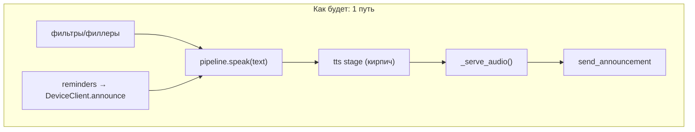

**Файлы**: `pipeline.py` (новый `speak`, `_serve_audio`), `esphome_client.py`
(`announce`, `play_media`), `runtime.py` без изменений (всё уже есть).

---

## R6. «Медленные» инструменты: метаданные вместо подстрок имён

### Проблема

[pipeline.py:76-100](../src/pipeline.py#L76-L100): оркестратор угадывает по
подстрокам имени (`"google"`, `"погод"`, …), медленный ли инструмент.
Привязка к naming-конвенциям чужих MCP-серверов; новый медленный инструмент с
«не тем» именем молча ломает филлеры.

### Решение

Источник инструментов сам декларирует скорость своих инструментов — он
единственный, кто это знает. Гранулярность — на уровень источника (совпадает
с реальностью: weather/calendar/web-search медленные целиком, smart-home —
быстрый целиком), с переопределением для внешних серверов в конфиге:

```python
# tool_hub.py
class ToolSource:
    slow: bool = False     # do tools of this source warrant a spoken filler?

class ToolHub:
    def is_slow(self, name: str) -> bool:
        src = self._routes.get(name)
        return bool(src is not None and src.slow)
```

- `BuiltinMcpSource(id, server, slow=...)`: weather → `True`, calendar →
  `True`, reminders → `False` (проставляется в `tool_factory.build_sources`).
- `McpServerConfig` получает поле `slow: bool = False` — оператор помечает
  внешний сервер (например, web-search) в панели.
- `_speak_filler` в pipeline: `any(self.hub.is_slow(n) for n in tool_names)`;
  `SLOW_TOOL_MARKERS` и `is_slow_tool` удаляются.

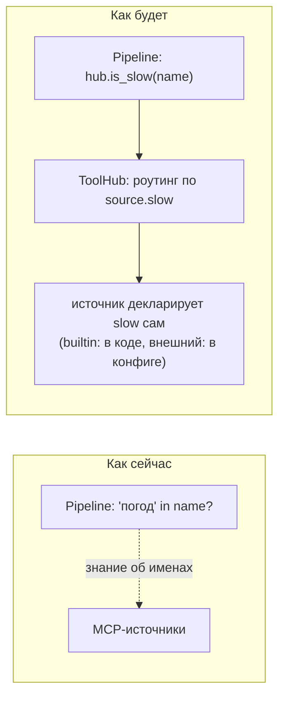

**Файлы**: `tool_hub.py`, `tool_factory.py`, `core_config.py`
(`McpServerConfig.slow`), `pipeline.py`.

---

## R7. LLM-стадия как кирпичик: `LlmStage` с явным входом/выходом

### Проблема

Настоящая LLM-стадия — свободная функция
[`call_llm_api(llm_backend, hub, text, *, core, llm_cfg, history, trace, device, on_filler)`](../src/llm.py#L18-L29):

- принимает **весь** `CoreConfig` (сборка system prompt с чтением файла —
  внутри стадии);
- наполняет mutable `trace`-словарь с незадекларированной схемой, которую
  знают три модуля (llm/pipeline/runs_store);
- сама публикует `current_device` в ContextVar (скрытый боковой канал);
- ошибки — строкой (см. R1).

### Решение

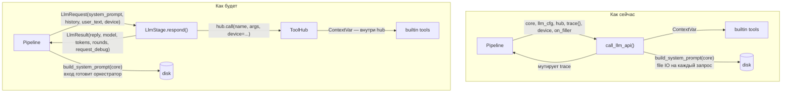

Контракт:

```python
# llm.py (the stage module)
@dataclass(frozen=True)
class LlmRequest:
    system_prompt: str          # assembled by the ORCHESTRATOR (prompt.py)
    history: list[dict]
    user_text: str
    device: str | None          # passed to hub.call, not via ContextVar here

@dataclass
class LlmResult:
    reply: str                  # raw model text (cleaned of think/command tags)
    model: str | None
    tokens: int | None
    rounds: list[dict]          # same per-round shape as today
    request_debug: dict         # the former trace["request"]
    tool_used: bool

class LlmStage:
    """The agentic tool loop as a stage brick. Thin and stateless:
    constructed per run from the live runtime refs, so hot-swapped
    backends/config apply naturally."""
    def __init__(self, backend: LlmBackend, hub: ToolHub, cfg: LlmConfig): ...

    async def respond(self, req: LlmRequest, *, on_filler=None) -> LlmResult:
        """Raises StageError("llm", kind=...) on failure (see R1)."""
```

Сопутствующие решения:

- **system prompt готовит оркестратор**: `pipeline._run` вызывает
  `build_system_prompt(self.core)` и кладёт в `LlmRequest`. Стадия перестаёт
  зависеть от `CoreConfig` целиком.
- **ContextVar уходит в ToolHub**: `hub.call(name, args, *, device=None)`
  оборачивает `source.call` в `current_device.set/reset`. Боковой канал для
  builtin-инструментов остаётся (это удобно), но втыкается в единственном
  месте, у владельца инструментов; LLM-стадия про него не знает.
- **`trace` умирает**: pipeline копирует поля `LlmResult` в `record`
  (схема `record` остаётся как есть — её знают pipeline и runs_store, это
  одна граница вместо трёх).
- **`on_filler` остаётся** колбэком (это легитимный прогресс-канал стадии),
  но его сигнатура фиксируется в докстринге стадии:
  `async (text: str, tool_names: list[str]) -> None`; политика
  (однократность, slow-фильтр через `hub.is_slow`) — по-прежнему в pipeline.

**Файлы**: `llm.py` (переписывается в `LlmStage`), `tool_hub.py`
(`call(..., device=)`), `pipeline.py` (`_run`: сборка `LlmRequest`,
чтение `LlmResult`), `run_context.py` — без изменений, `tests/test_llm.py`.

---

## R8. Формат аудио — забота доставки, не синтеза (опционально)

### Проблема

Piper-бэкенд и чайм-утилиты перекодируют WAV→MP3, потому что «прошивка
колонки не умеет WAV» ([tts.py:174-199](../src/tts.py#L174-L199)) — знание об
устройстве внутри стадии синтеза.

### Решение

TTS-бэкенд возвращает **родной** формат (`piper → audio/wav`); согласование с
потребителем — на точке доставки:

```python
# src/audio_codec.py
PLAYABLE_MIMES = {"audio/mpeg", "audio/flac"}   # what the speaker firmware decodes

def to_playable(mime: str, audio: bytes) -> tuple[str, bytes]:
    """Transcode to a speaker-decodable format if needed (wav -> mp3).
    Lives at the delivery boundary, not inside synthesis backends."""
```

После R5 точек доставки остаётся две (`_run` и `speak`/`_serve_audio`) —
`to_playable` вызывается в `_serve_audio` (в `asyncio.to_thread`, как сейчас).
`wav_to_mp3`/`lameenc` переезжают в `audio_codec.py`; Piper-бэкенд теряет
импорт `lameenc`; `make_ack_chime_mp3` → `src/chime.py` (использует
`audio_codec`).

**Статус: опционально, последним.** Поведение не меняется, чистая
перестановка ответственности; делать после R3/R5, чтобы не конфликтовать.

---

## R9. Раскладка модулей: одна схема для всех стадий

### Проблема

Кирпичики собраны по трём разным схемам: классы STT/TTS-бэкендов в
`src/stt.py`/`src/tts.py` + тонкие провайдеры в `plugins/`; у LLM наоборот;
плюс легаси-фабрика `make_stt_backend` (живёт ради двух тестов) и
`tts.py`-свалка.

### Решение

```
src/
  pipeline.py            # тонкий оркестратор
  pipeline_events.py     # StageEvent (R4)
  stage_errors.py        # StageError (R1)
  audio_prep.py          # pre-STT conditioning: highpass/normalize/trim (R2)
  audio_codec.py         # wav_to_mp3, to_playable (R8)
  chime.py               # make_ack_chime_mp3, build_ack_clip (из tts.py/pipeline.py)
  llm_text.py            # clean_llm_output (R3)
  vad.py                 # VadBackend/VadSession ABC + EndpointPolicy (R2)
  stt.py                 # SttBackend ABC + pcm_to_wav (только контракт)
  tts.py                 # TtsBackend ABC + split_sentences (только контракт)
  llm.py                 # LlmStage + LlmRequest/LlmResult (R7)
  plugins/
    vad/webrtc.py        # класс бэкенда + провайдер + его константы
    stt/groq.py          # GroqSttBackend ЦЕЛИКОМ здесь + Whisper-фильтр галлюцинаций
    stt/vosk.py          # VoskSttBackend целиком здесь
    llm/{openrouter,groq,...}.py
    tts/piper.py         # PiperTtsBackend + stress_to_acute/phonetic_ru применение
    tts/yandex.py        # YandexTtsBackend (без обратной конверсии)
    tts/teratts.py
    tts/_ru_text.py      # общие текст-хелперы для русских движков (R3)
```

Правила:

- **Класс бэкенда живёт в модуле своего провайдера** — одна папка = один
  кирпич целиком (конфиг-схема + реализация + специфические хаки).
- В `src/{vad,stt,llm,tts}.py` — только контракт стадии (ABC + общие чистые
  хелперы). Оркестратор импортирует только их.
- `make_stt_backend` удаляется; его тесты переходят на
  `REGISTRY`/`ConfigService.create`.
- **Whisper-фильтр галлюцинаций** (`STT_HALLUCINATION_MARKERS`,
  [pipeline.py:62-92](../src/pipeline.py#L62-L92)) переезжает в
  `plugins/stt/groq.py`: `GroqSttBackend.transcribe` сам возвращает `""`,
  если распознал свой известный артефакт. Vosk перестаёт «лечиться» от чужой
  болезни. (Скип STT при `reason="no_speech"` остаётся в pipeline — это
  generic-оптимизация, не знание о Whisper.)

---

## План миграции

Каждый шаг — независимо выкатываемый, с зелёными тестами. Порядок учитывает
зависимости и риск:

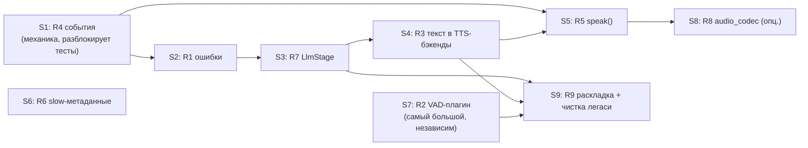

| Шаг | Содержимое | Риск | Заметки |
| --- | --- | --- | --- |
| S1 | `StageEvent` + переводчик в DeviceClient | низкий | чисто механический; правки тестов на VAET |
| S2 | `StageError`, STT/LLM/TTS на исключениях, `reply_error` | средний | меняется наблюдаемость (STT-сбой теперь `error`, а не `empty`) — это цель |
| S3 | `LlmStage`/`LlmRequest`/`LlmResult`, `hub.call(device=)`, смерть `trace` | средний | `tests/test_llm.py` переписываются на новый контракт |
| S4 | `clean_llm_output` + текст-хелперы в TTS-бэкендах | средний | проверить на обоих движках вживую: ударения у Piper, «+» у Yandex |
| S5 | `pipeline.speak()`, `announce` через него, `play_media` через Runtime | низкий | чинит расхождение напоминаний |
| S6 | `ToolSource.slow`, `McpServerConfig.slow`, `hub.is_slow` | низкий | независим, можно в любой момент |
| S7 | `VadBackend`/`plugins/vad/webrtc`, `audio_prep.py`, vad-слот в конфиге | **высокий** | единственный шаг с миграцией `config.json`; тесты `test_pipeline.py` (monkeypatch `_vad`) переходят на фейковый `VadSession` |
| S8 | `audio_codec.to_playable`, Piper отдаёт WAV | низкий | опционально |
| S9 | переезд классов в плагины, удаление `make_stt_backend`, Whisper-фильтр в groq | низкий | можно дробить по одной стадии |

### Что сознательно НЕ меняем

- Механика конкуренции (`_claim`, eager `on_audio`, `_live_send_tail`,
  fire-and-forget ack/filler-таски) — корректна, остаётся как есть.
- Capture-режим (`arm_capture`/`_finish_capture`) — остаётся в Pipeline: это
  устройство-уровневая функция, пайплайн стадий она и так обходит.
- `Runtime` read-through и контракты `Reconfigurator` — расширяются на vad,
  но не пересматриваются.
- Схема `record` в runs_store/панели — остаётся (R7 лишь убирает третьего
  знающего — llm.py).
